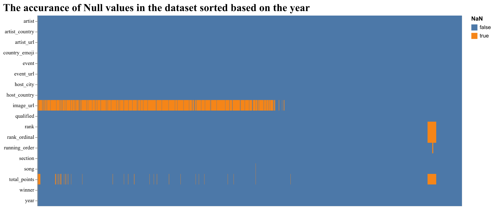

```{r setup, include=FALSE}
knitr::opts_chunk$set(echo = FALSE)
library(knitr)
library(tidyverse)
library(pandoc)
library(rmarkdown)
```

## Contributors

-   Mohammad Reza Nabizadeh
-   Crystal Geng
-   Renzo Wijngaarden
-   Daniel Cairns

The report on our data analysis project for DSCI 522 as part of the Master of Data Science program at the University of British Columbia.

## Introduction

Eurovision is an annual singing contest that takes place in Europe where each participating country is represented by a contestant performing a song of their choice, and the country which gains the highest number of votes in the final (which is ranked the highest) is elected to be the winner.

In this project, we are going to explore if there is any association between the running order and the rank of a contestant in Eurovision. Does the country that performs their act the last rank higher than the country that performs the first? We are interested in this question because order can potentially have a large effect on the outcome of a competition. For instance, [@queen] have shown that the contestants who perform later tend to gain a higher rank from the jury in the Queen Elisabeth Contest. This question is crucial because it is related to the bias in voting and fairness of competitions.

## Dataset

The dataset we use in this project is retrieved from the [Tidy Tuesday Public Repository](https://github.com/rfordatascience/tidytuesday/tree/master/data/2022/2022-05-17) [@tidytue], and the original data was sourced from the [Eurovision Song Contenst Official Website](https://eurovision.tv/) [@eurovision]. The data was further cleaned up and scraped by Tanya Shapiro and Bob Rudis and contributed to the Tidy Tuesday Repository.

## EDA

In our exploratory data analysis, we have included the following figures:

```{r fig.align='center', out.width="100%", fig.cap = "Figure1: Pair-wise correlation of numerical columns"}
knitr::include_graphics("../src/eda_data/figures/pair_wise_corr_plot.png")
```


As we can see from this first plot, there doesn't appear to be a strong correlation between running order and rank.


```{r fig.align='center', out.width="100%", fig.cap = "Figure2: The accurance of null values in the dataset"}

```

From this plot we can get a general idea of what our data looks like. The image column is missing a lot of data, and around the year 2021 we have a big gap in values because of COVID-19.

## Proposed Data Analysis

From our EDA we determined, by looking at the correlation plot for running order and resulting rank, that there didn't appear to be a strong correlation between these two variables.

In order to answer the inferential question above, we are looking to conduct various t-tests. To carry out the t-test, we will first carry out the following two hypothesis tests:

Firstly, the null hypothesis is defined such that the mean rank of countries not performing first is the same as countries performing first, and the alternative hypothesis is that the mean rank of countries not performing first is different from the mean rank of countries performing first.

$$
H_0 : \mu_\text{first} = \mu_\text{rest} \text{ vs } H_a : \mu_\text{first} \neq \mu_\text{rest}
$$

Next, we look at the last performance of the night. We define the null hypothesis such that the mean rank of countries not performing last is the same as countries performing last, and the alternative hypothesis is that the mean rank of countries not performing last is different from the mean rank of countries performing last.

$$
H_0 : \mu_\text{last} = \mu_\text{rest} \text{ vs } H_a : \mu_\text{last} \neq \mu_\text{rest}
$$

Since the dataset contains the results for both the semi-finals and the grand-finals, we next look to see if there's a difference between these shows. We separate results from these categories, and carry out the same hypothesis tests.

## Results

```{r two sample t-test table, message=FALSE, warning=FALSE}
general_test <- read_csv("../results/t_test_results_general_dataset.csv")
knitr::kable(general_test, caption = "Table 1. Two sample t-test results for countries that perform first and last vs. the rest of the countries overall") |>
  kableExtra::kable_classic(full_width = F, lightable_options = "basic", html_font = "Cambria")

```

From Table 1 that shows our two sample t-test results, it can be seen that the p-value for countries that perform the first and those do not is approximately 0.78, which indicates that the difference of relative ranks between the countries that perform the first and those do not is not statistically significant [@t-test]. Since this p-value is significantly larger than the $\alpha$-level of 0.05, we conclude that we do not have enough evidence to show that there is a difference in the mean relative ranks between the countries that perform first and the rest of them. In contrast, the p-value for the countries that perform the last and those do not is around 0.0004, which is significantly smaller than our $\alpha$-level of 0.05. We can conclude that we have enough evidence to show that there is a significant difference between the countries that perform the last and the rest of them. Therefore we reject the null hypothesis, and conclude that there is a difference in the relative ranks between the countries that perform last and those do not.

```{r two sample t-test table semi final, message=FALSE, warning=FALSE}
semi_final_test <- read_csv("../results/t_test_results_semi_final_dataset.csv")
knitr::kable(semi_final_test, caption = "Table 2. Two sample t-test results for countries that perform first and last vs. the rest of the countries in the semi-final") |>
  kableExtra::kable_classic(full_width = F, lightable_options = "basic", html_font = "Cambria")

```

From Table 2 which shows the results of the semi-finals, it can be seen that the p-value for the countries that perform the first and those that do not in the semi-final is around 0.58, which is considerably higher than the \$\\alpha\$-level of 0.05. Therefore we fail to reject the null hypothesis that the mean relative ranks of the countries that perform the first and those do not in the semi-final are the same. In contrast, the p-value for the countries that perform last and those do not in the semi-final is approximately 0.00007, which is significantly smaller than the $\alpha$-level of 0.05. Therefore we have enough evidence to reject the null hypothesis and conclude that there is a significant difference in the mean relative ranks between the countries that perform the last and those do not.

```{r two sample t-test table final, message=FALSE, warning=FALSE}
final_test <- read_csv("../results/t_test_results_final_dataset.csv")
knitr::kable(final_test, caption = "Table 3. Two sample t-test results for countries that perform first and last vs. the rest of the countries in the final") |>
  kableExtra::kable_classic(full_width = F, lightable_options = "basic", html_font = "Cambria")

```

From Table 3 it can be seen that the p-values for both groups are comparable and both are higher than the $\alpha$-level of 0.05, which means that we fail to reject both null hypotheses and conclude that there is no major difference in the mean relative ranks between the countries that perform first or last and the rest of them.

From the two sample t-test results of d the above analyses, we can conclude that the countries that perform the last tend to have a higher rank than the ones that do not perform the last, both overall and in the semi-finals. However, there is no major impact of performing orders on the relative rank in the finals. One possible explanation to this observation could be the fact that the audience do not spend as much time on watching the semi-finals as the finals. Not everyone might start watching the semi-finals from the very beginning of the show, while more audience tend to watch the finals from the beginning to the end. As a result, the last performance might be more memorable to the audience compared to the previous one and ends up getting higher votes in the semi-finals. However, this discrepancy could also be attributed to the much smaller number of data points in the dataset compared to that of the finals.

For future work, we can also build a linear regression model to assess the linear relationship between performing order and rank. In addition, we can conduct simulation test by permutation through bootstrapping and compare the results with the t-tests.

## Sharing the Results

Our analysis will be conducted using Python and R scripts, where any created tables and plots will be stored in relevant directories. This report will use the outputs of these scripts to visualise and convey our findings. In order to render all the plots properly, we will also export a PDF version of this report. For sharing purposes, all of our analyses and results will be pushed to our GitHub repository.

## References
